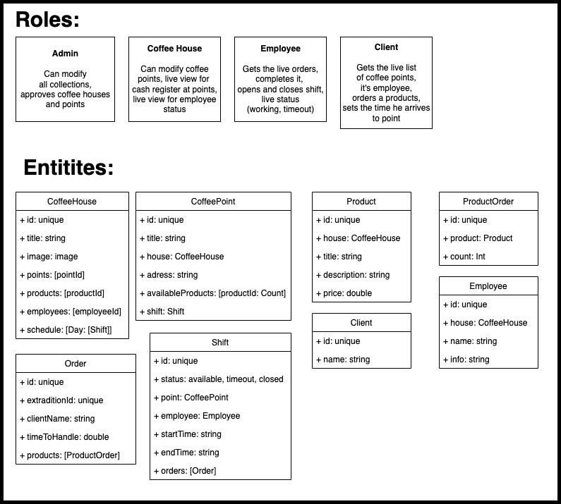

# CoffeeNetwork

## Check [usage](Media/USAGE.md) to try it out

## TODO:

## User Roles:
* Admin
* Coffee House
* Coffee House Employee
* Customer

## Admin usecases:
* CRUD Admins List
* CRUD Coffee Houses List
* Accept new Coffee House Points
  
## Coffee House usecases:
* CRUD Coffee House Points
* CRUD Coffee House Products
* CRUD Coffee House Employee
* CRUD Coffee House Schedule
* Live Cash Register and Orders at Coffee House Points

## Coffee House Employee usecases:
* Open/Close Shifts
* Set available Products at it's Coffee House Point
* Accept orders
* Set status for Coffee House Point (open, close, timeout)

## Customer usecases:
* Map with nearest open Coffee House Points
* Ordering enabled
* Orders history

# Data scheme

